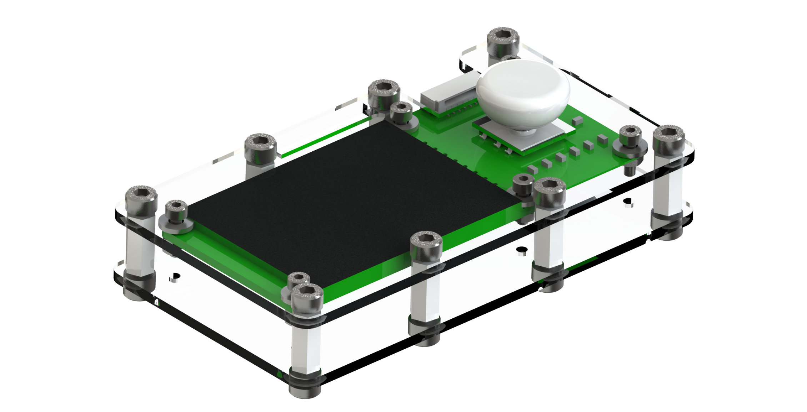

# RoboMaster-BoardOLED-Substitute
1.8' TFT Screen with 5-way Button for RM_Board_A

BOM
1. [淘宝]1.8' TFT: https://item.taobao.com/item.htm?spm=a1z09.8149145.0.0.90a3cd746LDfD4&id=583173435654&_u=v3v7jal56759
2. [嘉立创]Button Board File: ~发加工/Project Outputs for RM_OLED_BUTTON_嘉立创.zip
3. [淘宝]5-way Button: https://detail.tmall.com/item.htm?id=548553504454&spm=a1z09.2.0.0.593c2e8d9nnzQa&_u=v3v7jal5afca
4. [淘宝]M2*8螺丝螺母若干，M3*5螺丝若干，M3*10铜柱若干，自备M2、M3钻头

BUG
1. 现孔位有较大误差，需要钻孔。
